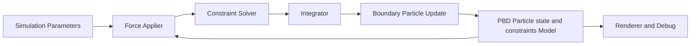

# 📚 Position Based Dynamics Cloth Balloons with Boundary Particles

## Overview

Position-Based Dynamics(PBD)를 기반으로 한 실시간 Cloth Balloon 시뮬레이션 구현으로,  
Boundary Particle을 도입하여 시뮬레이션의 안정성과 제어성을 향상시킨다.

---

## 📌 Problem Statement & Motivation

본 프로젝트에서는 PBD로 구성된 물체의 경계를 명시적으로 표현하고
시뮬레이션 안정성을 향상시키기 위해 Boundary Particle을 도입한다.

Boundary Particle은 기존 PBD 입자 집합을 기반으로
물체의 표면 또는 경계 영역에 추가적으로 생성되는 보조 입자로, 물체의 형태 변화에 따라
Boundary Particle을 실시간으로 생성하여 업데이트한다.

이를 통해 시간 간격 변화나 외력 변화에도
안정적인 PBD 시뮬레이션을 구현한다.

---

## 📌 Core Idea: Position-Based Dynamics with Boundary Particles

본 ClothBalloons Simulation은 **Position-Based Dynamics(PBD)**의
constraint projection 방식을 기반으로 구현되었다.
물체를 입자(particle)의 집합으로 표현하고,
입자 간의 구조적·기하학적 관계를 제약 조건(constraint) 으로 모델링한다.

본 프로젝트에서는 이러한 제약 조건에 의해
입자들의 상대적 위치와 형태가 지속적으로 변화하는 점에 주목하여,
각 스텝에서 갱신된 PBD 입자 분포를 기반으로
물체의 경계(boundary)를 동적으로 추정하고,
이에 따라 Boundary Particle을 실시간으로 생성 및 업데이트한다.

Boundary Particle은 기존 PBD 제약 구조를 변경하지 않으면서
경계 영역의 입자 밀도를 보강하는 보조 입자 계층으로,
제약 조건에 따른 물체 형태 변화에 유연하게 대응하며
시뮬레이션 전반의 안정성과 제어성을 향상시키는 역할을 수행한다.

## Boundary Particle Generation & Update

Boundary Particle은 각 시뮬레이션 스텝에서
제약 조건이 적용된 이후의 PBD 입자 분포를 기반으로 생성된다.

본 구현에서는 현재 스텝의 입자 위치를 이용해
물체의 경계 영역을 추정하고,
해당 경계에 대해 일정 간격 또는 밀도 기준을 만족하도록
Boundary Particle을 추가적으로 배치한다.

시뮬레이션이 진행되며 입자 분포가 변화할 경우,
Boundary Particle 또한 매 스텝 재생성 또는 업데이트되어
물체의 형태 변화에 동적으로 대응한다.
이를 통해 고정된 경계 표현 없이도
실시간 환경에서 안정적인 경계 처리가 가능하다.

  
   
  <em>Figure. Example of Boundary Particles generated around a PBD object.</em>

## 📌 System Architecture

본 Cloth Simulation 시스템은 다음 구성요소로 이루어져 있다:
- Simulation parameters (dt, iterations, stiffness)
- Cloth model composed of particles and constraints
- External force application (gravity, user forces)
- Iterative PBD constraint solver
- Integration
- Boundary particle manager (initialize + per-step update based on constraint-updated particle distribution)
- Rendering and debugging

---

## 📌 Key Implementation Details

본 섹션에서는 Boundary Particle을 구성하기 위한
edge / inner sampling 전략, 업데이트 정책,
그리고 normal 추정 방법을 단계적으로 설명한다.

---

## 1. Boundary Particle Classification

Boundary Particle은 생성 위치와 역할에 따라
Edge Boundary Particle과 Inner Boundary Particle로 구분된다.

Edge Boundary Particles
→ 인접한 두 기준 particle 사이의 경계를 따라 배치

Inner Boundary Particles
→ 삼각형 내부 영역의 입자 밀도를 보강하기 위해 생성

---

## 2. Edge Boundary Particle Sampling

Edge boundary particle은 인접한 두 기준 particle 사이를
사용자가 정의한 배치 간격 d 기준으로 등간격 샘플링하여 생성된다.

  

  
<b>2.1 Sampling Count 결정</b>

  
  두 기준 particle의 위치를 p0, p1이라 하면,
  
  구간 길이
  L = ||p1 - p0||
  
  배치 간격
  d
  
  생성할 edge particle 개수
  n = floor(L / d)
  (정수화 방식은 구현 정책에 따름)
  
  이 값은 매 시뮬레이션 스텝마다,
  constraint 적용 후의 최신 위치를 기준으로 다시 계산된다.

  
<b>2.2 Particle 배치</b>

  
  방향 단위벡터
  t = (p1 - p0) / ||p1 - p0||
  
  i번째 edge particle 위치
  x_i = p0 + t * (i * d) , i = 1..n
  
  이 방식으로 두 기준 particle 사이에
  균일한 밀도의 edge boundary particle을 유지한다.

---

## 3. Inner Boundary Particle Sampling

Inner boundary particle은 삼각형 단위로 생성되며,
삼각형 내부를 라인 방식으로 샘플링한다.

핵심 아이디어는
 **삼각형의 가장 짧은 edge**를 기준 축으로 삼는 것이다.

  

  
<b>3.1 기준 Edge 선택</b>

  
  삼각형의 꼭짓점 위치를 v0, v1, v2라 할 때,
  
  세 변 중 길이가 가장 짧은 edge를 선택
  
  이를 기준 edge e = (a, b)로 정의
  
  이 edge는 이후 내부 샘플링 라인의 방향 기준이 된다.

  
<b>3.2 수선 방향 정의</b>

  기준 edge에 포함되지 않은 나머지 꼭짓점을 c라 하면,
  
  기준 edge 방향 단위벡터
  s = (b - a) / ||b - a||
  
  c에서 edge로의 투영으로 수선의 발 h 계산: 
  
  h = dot(s, a) 

  
<b>3.3 Sampling Line 개수 결정</b>

  배치 간격 d 기준
  
  내부 평행 라인 개수
  nt = floor(h / d)
  
  각 라인은 기준 edge와 평행하며,
  k * d 만큼 수선 방향으로 이동한 위치에 생성된다.

  
<b>3.4 각 라인에서 Particle 배치</b>

  
  각 sampling line (k = 1..nt)에 대해:
  
  삼각형 경계와의 교차로 선분 시작/끝 결정
  
  선분 길이를 L_k라 할 때,
  
  ns = floor(L_k / d)
  
  d 간격으로 inner boundary particle 배치
  
  이 과정은 edge sampling 로직을 그대로 재사용한다.

---

## 4. Boundary Particle Update Strategy

삼각형의 형태와 edge 길이는 시뮬레이션 중 지속적으로 변하므로,
boundary particle은 매 스텝 동적으로 갱신된다.

### Case A: Sampling Count 유지 (n 동일)

위치(position)와 normal만 업데이트(기존 boundary particle 유지)

### Case B: Sampling Count 변경 (n 변화)

현재 상태를 기준으로 전체 resampling(기존 boundary particle 제거)

이 전략을 통해 불필요한 재생성 최소화를 동시에 달성한다.

---

## 5. Normal Estimation and Update

Boundary particle은 자체 normal을 가지지 않으므로,
주변 기준 입자의 normal을 보간하여 매 스텝 갱신한다.

  
<b>5.1 Edge Boundary Normal</b>

  (Linear Interpolation)
  
  두 기준 입자의 normal을 n0, n1이라 하면,
  
  상대 위치 비율
  t = ||x - p0|| / ||p1 - p0||
  
  보간된 normal
  n = normalize((1 - t) * n0 + t * n1)
  
  
  

  
  이 방식은 edge 방향을 따라 연속적인 normal 변화를 보장한다.

  
<b>5.2 Inner Boundary Normal</b>

  (Barycentric Interpolation)
  
  삼각형 꼭짓점 normal을 n0, n1, n2라 하면,
  
  barycentric weight (w0, w1, w2)
  
  보간된 normal
  n = normalize(w0 * n0 + w1 * n1 + w2 * n2)
  
  
  

  
  삼각형 내부에서 위치 기반으로 일관된 normal field를 형성할 수 있다.

---

## 📌 실행 예시 및 샘플 출력 

https://github.com/user-attachments/assets/a02539d0-6f38-428f-9b91-188d75c57cfd

